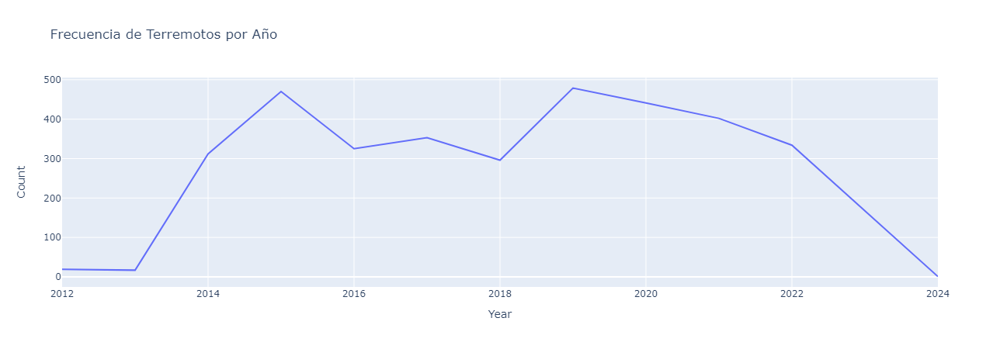
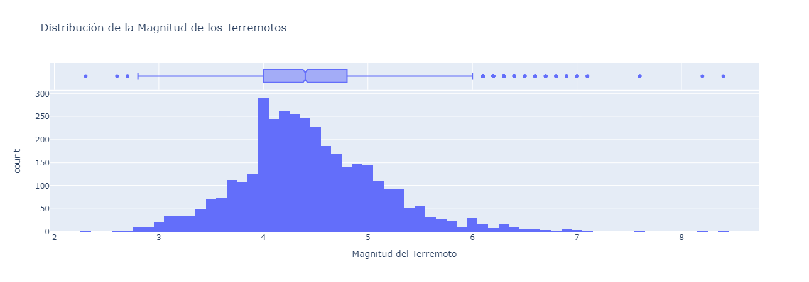
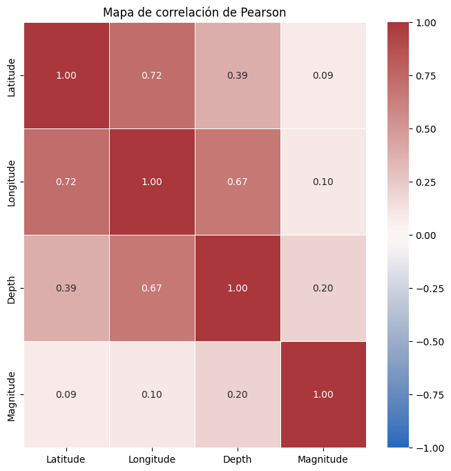
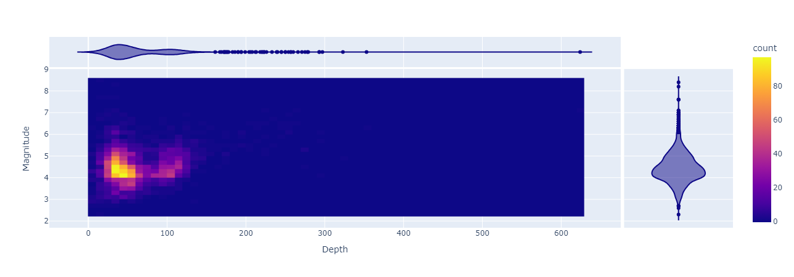
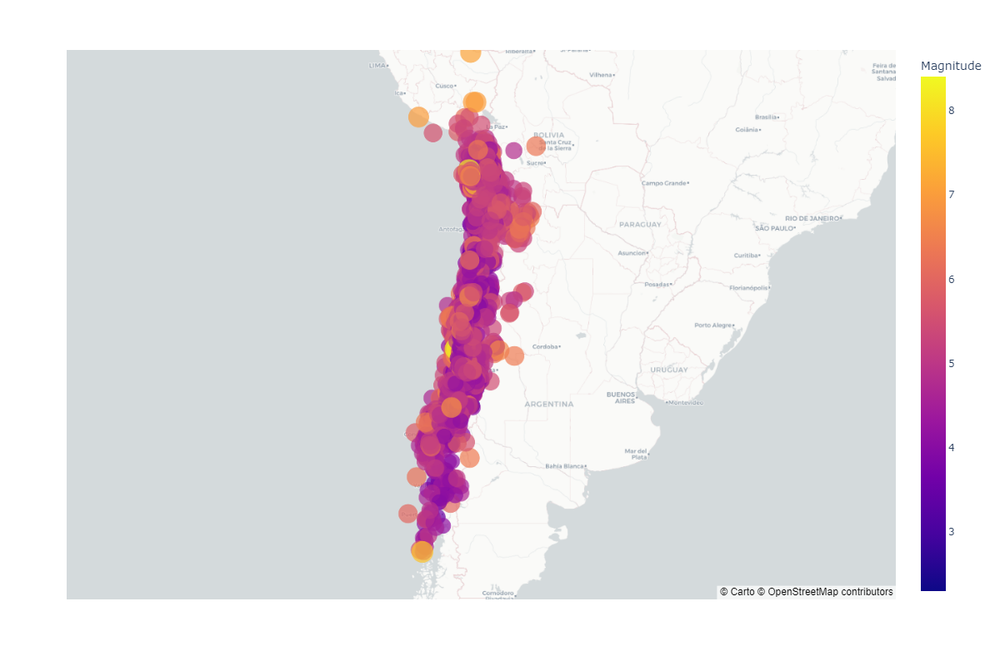

# ChileEarthquakes
An analysis of earthquakes in Chile between 2012 and 2024

#### Chile, situated along the Pacific Ring of Fire, is one of the most seismically active regions on Earth. Over the past decade, from 2012 to 2024, Chile has experienced numerous seismic events. This analysis delves into the occurrence of earthquakes during this period, focusing on their geographical distribution, magnitudes, and depths. 

##### data source https://evtdb.csn.uchile.cl

### Cleaning Data
The db doesn't contain null data

However, it contains a time series that was imported as object, so it must be changed to dt

### EDA
The mean and median of the magnitudes are quite similar

The data frequency appears to exhibit anomalies at the extremes, attributed to the limited amount of data available. However, for the remaining years, the distribution appears to align more closely with expected norms

If we examine the distribution of earthquake magnitudes, it becomes apparent that the vast majority of data falls within the range of 4 to 5 degrees. The most frequent occurrence is that of 4 degrees, which appears 290 times

When examining the distribution of magnitude over time compared to depth, a certain level of typicality is observed in the data. Thus, at first glance, there appears to be no strong correlation between depth and earthquake magnitude

After conducting a Pearson correlation, the coefficient 'r' between magnitude and depth is found to be 0.20. This outcome aligns with expectations following the observation of the magnitude-depth plot over time.

Upon generating a density map to visualize occurrences of depth in conjunction with magnitude, it is evident that the majority of events cluster around an approximate depth of 50 kilometers. The data exhibits a typical pattern

When observing earthquake occurrences on a geographic map, there does not appear to be any particular regions in Chile where earthquakes are more predominant, except for the southernmost part of the country where fewer significant occurrences are noted

### Summary

In conclusion, the analysis of earthquakes in Chile between 2012 and 2024 reveals significant insights into seismic activity patterns in the region. Despite anomalies in data frequency attributed to limited data availability, the distribution of earthquakes aligns closely with expected norms. While no strong correlation between magnitude and depth is initially observed, a Pearson correlation coefficient of 0.20 confirms a subtle relationship. Density mapping illustrates clustering around a depth of approximately 50 kilometers. Geographic visualization indicates no specific region with predominant seismic activity, except for fewer occurrences in the southernmost part of Chile. 

This work remains open to further study, such as analyzing the geographical occurrence of earthquakes with tectonic faults, thus explaining the fewer occurrences in southern Chile. Additionally, a seasonal analysis could provide valuable insights into temporal patterns of seismic activity. 
